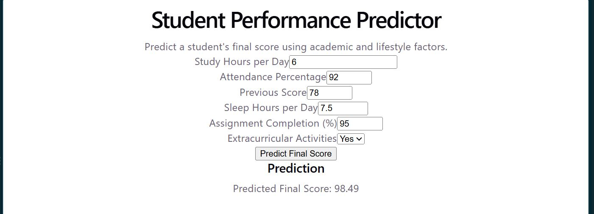

# 🎓 Student Performance Predictor

A machine learning web application that predicts a student's final performance score based on academic and lifestyle-related factors.

The project combines a **React frontend**, **FastAPI backend**, and **Scikit-learn machine learning models** to create an end-to-end ML prediction system.

---

## 📌 Project Overview

The Student Performance Predictor takes the following information from a user:

- Study hours
- Attendance percentage
- Previous exam score
- Sleep hours
- Assignment completion percentage
- Extracurricular activity participation

The input is processed and passed to a trained machine learning model, which predicts the student's expected final score.

The project demonstrates the complete machine learning workflow:

**Data → Preprocessing → Training → Evaluation → Model Selection → Prediction → API → Web Interface**

---

## ✨ Features

- 📊 Student performance prediction
- 🧹 Missing-value handling
- 🔢 Categorical feature encoding
- ⚖️ Feature scaling using `StandardScaler`
- 🤖 Linear Regression model
- 🌲 Random Forest Regression model
- 📈 Model evaluation using:
  - MAE
  - MSE
  - RMSE
  - R² Score
- 🏆 Automatic selection of the better-performing model
- 💾 Saved trained model using Joblib
- ⚡ FastAPI prediction API
- ⚛️ React + Vite frontend
- 🔗 Frontend-to-backend integration

---

## 🛠️ Tech Stack

### Machine Learning

- Python
- Pandas
- NumPy
- Scikit-learn
- Joblib

### Backend

- FastAPI
- Uvicorn

### Frontend

- React
- Vite
- JavaScript
- CSS

### Development Tools

- VS Code
- Git
- GitHub

---

## 📂 Project Structure

```text
student-performance-predictor/
│
├── data/
│   └── student_performance.csv
│
├── model/
│   ├── best_model.pkl
│   ├── scaler.pkl
│   ├── feature_columns.pkl
│   └── model_name.pkl
│
├── public/
│
├── src/
│   ├── assets/
│   ├── App.jsx
│   ├── App.css
│   ├── index.css
│   └── main.jsx
│
├── generate_dataset.py
├── train_model.py
├── predict.py
├── main.py
├── requirements.txt
├── package.json
├── package-lock.json
├── vite.config.js
└── README.md
---

## 📊 Dataset Description

The dataset contains **500 student records** and 7 columns:

| Feature | Description |
|---|---|
| `study_hours` | Average hours studied per day |
| `attendance_percentage` | Class attendance percentage |
| `previous_score` | Previous examination score |
| `sleep_hours` | Average hours of sleep per day |
| `assignment_completion` | Percentage of assignments completed |
| `extracurricular` | Participation in extracurricular activities (Yes/No) |
| `final_score` | Final examination score — prediction target |

During preprocessing, missing values in numeric features were replaced using the **median** of the corresponding column.

---

## 🔄 ML Workflow

The machine learning pipeline follows these steps:

1. Load the student performance dataset.
2. Check and handle missing values.
3. Encode the `extracurricular` categorical feature.
4. Separate features (`X`) and target (`y`).
5. Split the dataset into **80% training** and **20% testing** data.
6. Standardize the features using `StandardScaler`.
7. Train two regression models:
   - Linear Regression
   - Random Forest Regressor
8. Evaluate both models using MAE, MSE, RMSE, and R².
9. Select the model with the better R² score.
10. Save the selected model and preprocessing objects using Joblib.
11. Use the trained model through a FastAPI endpoint.
12. Display the prediction through the React frontend.

---

## 📈 Model Comparison

Two regression models were trained and evaluated on the same test set.

| Model | MAE | MSE | RMSE | R² |
|---|---:|---:|---:|---:|
| Linear Regression | 4.664 | 33.338 | 5.774 | **0.706** |
| Random Forest Regressor | 4.946 | 39.118 | 6.254 | 0.655 |

### 🏆 Best Model

**Linear Regression** was selected as the final model because it achieved the highest R² score.

- **R²:** 0.706
- **MAE:** 4.664
- **RMSE:** 5.774

The R² score of **0.706** indicates that the model explains approximately **70.6% of the variation** in the test-set final scores.

### Dataset Split

- Total samples: **500**
- Training samples: **400**
- Testing samples: **100**

---

## 📸 Screenshots


### Prediction Interface


```

---

## 🚀 How to Run Locally

### 1. Clone the repository

```bash
git clone https://github.com/laxmipriya-25/student-performance-predictor.git
cd student-performance-predictor
```

### 2. Install Python dependencies

```bash
pip install -r requirements.txt
```

### 3. Start the FastAPI backend

```bash
python -m uvicorn main:app --reload
```

The API will run at:

```text
http://127.0.0.1:8000
```

### 4. Install frontend dependencies

Open another PowerShell terminal in the project folder:

```bash
npm install
```

### 5. Start the React frontend

```bash
npm run dev
```

Open the local URL shown by Vite in your browser.

---

## 🎯 Future Improvements

- Add cross-validation for more reliable model evaluation
- Perform hyperparameter tuning
- Add feature importance visualization
- Add prediction confidence/uncertainty information
- Improve frontend UI/UX
- Deploy the FastAPI backend and React frontend
- Experiment with additional regression algorithms